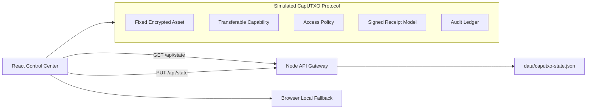

# CapUTXO Control Center

CapUTXO Control Center is a full-stack prototype for managing transferable cryptographic access rights. It demonstrates a core protocol idea:

> The encrypted asset stays fixed. The on-chain capability moves. The epoch advances. The controller stops issuing managed grants to the old owner and starts issuing managed grants to the new owner.

The app is built as a production-style control center with a React dashboard, an API-backed state gateway, receipt/proof workflows, transfer pipelines, policy controls, identity/key views, and audit logging.

## Table of Contents

- [Why CapUTXO](#why-caputxo)
- [Current Status](#current-status)
- [Features](#features)
- [Architecture](#architecture)
- [Project Structure](#project-structure)
- [Quick Start](#quick-start)
- [Scripts](#scripts)
- [API Gateway](#api-gateway)
- [State Model](#state-model)
- [Core Workflows](#core-workflows)
- [Security Model](#security-model)
- [Protocol Specification](#protocol-specification)
- [Production Readiness Roadmap](#production-readiness-roadmap)
- [Deployment](#deployment)
- [Development Notes](#development-notes)

## Why CapUTXO

Traditional encrypted file sharing tends to bind access to accounts, links, or centralized ACLs. CapUTXO explores a different model: bind managed future access to a transferable capability represented by a UTXO-like state object.

The asset itself does not move. The ciphertext stays fixed. What moves is the capability that the controller recognizes as current. When ownership transfers, the epoch advances. New managed grants are issued only to the new current owner.

This prototype makes that model tangible:

- Alice owns a capability at epoch `0`.
- The encrypted asset remains fixed.
- Alice transfers the capability to Bob.
- The capability state advances to epoch `1`.
- Alice becomes stale for future managed access.
- Bob becomes eligible for future managed access.
- Receipts and audit records explain every grant, denial, policy change, proof, and transfer event.

## Current Status

This repository is a polished full-stack prototype, not a production cryptographic controller.

Implemented:

- Interactive React control center.
- Local API gateway with JSON-backed durable state.
- Browser fallback state when the gateway is offline.
- Simulated assets, access requests, transfers, policies, receipts, identities, keys, and audit events.
- Proof bundle generation for the selected asset.
- Vercel-ready frontend build.

Not yet production:

- Wallet-backed BSV transaction signing and funding.
- Hosted production UTXO indexer with service-level guarantees.
- Production KMS/HSM/TEE/MPC integration.
- Multi-user database-backed authorization and tenant isolation.
- Immutable audit storage.

## Features

### Overview

- Current capability state.
- Owner, epoch, status, outpoint, policy, and finality summary.
- Managed transfer visual.
- Recent receipts and audit timeline.
- Fixed encrypted asset manifest panel.

### Mint

- Mint a simulated capability-backed encrypted asset.
- Choose initial owner.
- Choose access policy.
- Generate asset hash, outpoint, receipt, and audit record.

### Assets

- Searchable asset registry.
- Select active asset.
- Freeze and unfreeze assets.
- Jump into access, transfer, and receipt workflows.

### Access

- Simulate owner/currentness checks.
- Grant current owners.
- Deny stale or invalid requesters.
- Respect paused policies and frozen assets.
- Emit access receipts and audit entries.

### Transfers

- Prepare transfer from current owner to a new owner.
- Advance through:
  - Prepare
  - Precommit
  - Transfer
  - Finalize
- On finalization, update owner, owner key, epoch, and outpoint.
- Emit transfer receipts and audit entries.

### Receipts

- View grant, denial, mint, transfer, policy, proof, and asset status receipts.
- Click receipts to copy receipt ids.
- Generate a proof bundle for the selected asset.

### Policies

- View all supported access modes.
- Toggle active/paused policy state.
- Inspect grant TTL, download setting, and finality requirement.

### Audit

- Review event ledger for grants, denials, transfers, policy updates, asset status changes, and proof generation.

### System

- Identities page for Alice, Bob, Controller, and Mallory.
- Keys page for simulated KMS release conditions.
- Wallets page for non-custodial BSV wallet connection planning, watch-only addresses, UTXO discovery, and transfer signing intents.
- Settings page for persistence mode, runtime counts, health, and reset simulation.

## Architecture



The current backend is intentionally small. It gives the frontend a durable state service without pretending to be a full blockchain controller. The app can still run without it by falling back to browser-local storage.

## Project Structure

```text
.
├── data/
│   └── .gitignore              # local JSON state is ignored
├── server/
│   ├── index.mjs               # local API gateway
│   └── seed.mjs                # seed state
├── src/
│   ├── main.tsx                # React app, state, workflows
│   └── styles.css              # dashboard styling
├── index.html
├── package.json
├── vite.config.ts
├── tsconfig*.json
└── README.md
```

## Quick Start

Install dependencies:

```bash
npm install
```

Run the frontend only:

```bash
npm run dev
```

Run the full-stack prototype:

```bash
npm run dev:api
```

In a second terminal:

```bash
npm run dev
```

Open:

```text
http://localhost:4173
```

When the gateway is running, the footer shows `Storage API synced`. When it is offline, the app falls back to browser-local persistence.

## Scripts

```bash
npm run dev       # Start Vite frontend
npm run dev:api   # Start local API gateway on port 8787
npm run lint      # Run ESLint
npm run build     # Type-check and build production frontend
npm run preview   # Preview production build
```

## API Gateway

The gateway is implemented in `server/index.mjs` and listens on port `8787` by default.

### `GET /api/health`

Returns gateway health and storage information.

Example:

```json
{
  "ok": true,
  "storage": "json",
  "dataFile": "/path/to/data/caputxo-state.json"
}
```

### `GET /api/state`

Returns the full application state.

### `PUT /api/state`

Replaces the full application state. The frontend uses this endpoint to sync state changes after local actions.

### `POST /api/reset`

Restores seed state.

### Production-shaped command endpoints

The gateway also exposes command endpoints that move the project away from client-owned full-state writes:

- `GET /api/controller/public-key`
- `POST /api/auth/challenge`
- `POST /api/auth/verify`
- `POST /api/assets/mint`
- `POST /api/access/requests`
- `POST /api/transfers`
- `POST /api/transfers/:id/advance`
- `POST /api/assets/:id/status`
- `POST /api/policies/:id/toggle`
- `POST /api/receipts/proof`
- `POST /api/utxo/currentness`
- `POST /api/wallets/utxos`
- `POST /api/tx/intent`
- `POST /api/bsv/broadcast`
- `POST /api/receipts/sign`
- `POST /api/receipts/verify`

The cryptographic pieces use Node's built-in crypto primitives:

- Ed25519 controller identity for signed protocol objects and receipts.
- Deterministic canonical object hashing.
- AES-256-GCM key wrapping for simulated DEK custody.
- Signed challenge verification endpoint for wallet/auth integration.

The BSV adapter is intentionally a boundary, not a hidden wallet. It can verify UTXO currentness and broadcast a raw transaction through WhatsOnChain-compatible endpoints, but it does not fabricate private keys, spend user funds, or pretend to sign BSV transactions without a real wallet.

Wallet support is non-custodial:

- Users can add watch-only BSV testnet addresses.
- The gateway can discover UTXOs for an address.
- The app can prepare a transaction intent for an external wallet to sign.
- The app does not store private keys or seed phrases.
- Browser-provider detection is scaffolded so a future Yours/HandCash/RelayX-style integration can sign challenges and transaction intents in the user's wallet.

## State Model

The prototype state is centered around these records:

- `assets`: encrypted asset manifests and current capability state.
- `accessRequests`: simulated signed access requests.
- `transfers`: prepared, precommitted, broadcast, and finalized transfer records.
- `receipts`: controller-issued receipts for important actions.
- `audit`: human-readable operational ledger.
- `policies`: managed access policy modes.
- `wallets`: watch-only BSV wallet records and discovered UTXOs.
- `selectedAssetId`: active UI asset.
- `proofBundle`: most recently generated proof bundle.

Local API state is stored at:

```text
data/caputxo-state.json
```

That file is ignored by git so local workflow state does not leak into the repository.

## Core Workflows

### Mint Asset

1. Open `Mint`.
2. Enter an asset name.
3. Choose an owner.
4. Choose an access policy.
5. Click `Mint Asset Capability`.
6. The app creates an asset, a mint receipt, and an audit record.

### Request Access

1. Open `Assets` and select an asset.
2. Open `Access`.
3. Choose a requester.
4. Click `Verify & Issue Receipt`.
5. The app grants only if requester matches current owner, policy is active, and asset is active.

### Transfer Capability

1. Select an asset.
2. Open `Transfers`.
3. Choose a new owner.
4. Click `Prepare Transfer`.
5. Advance the transfer until finalized.
6. Finalization changes owner, owner key, outpoint, and epoch.

### Generate Proof

1. Select an asset.
2. Open `Receipts`.
3. Click `Generate Proof Bundle`.
4. The proof bundle is displayed and copied to clipboard when browser permissions allow it.

## Security Model

This prototype is designed to illustrate the security posture, not enforce it cryptographically yet.

### Claims Modeled

- Future managed access follows the current capability owner.
- Stale owners are denied future managed grants.
- Frozen assets deny new managed access.
- Policy state influences access decisions.
- Receipts and audit records explain controller decisions.

### Non-Claims

CapUTXO does not claim that:

- a prior owner cannot retain plaintext;
- a prior owner cannot retain a released DEK;
- screenshots or screen recordings can be cryptographically erased;
- a browser viewer is strong DRM;
- local prototype state is tamper-proof.

### Production Security Requirements

Before real-world use, this needs:

- wallet authentication;
- signed challenge verification;
- canonical JSON or binary encoding for signed objects;
- receipt signatures;
- state hash verification;
- BSV currentness checks;
- replay protection;
- server-side authorization;
- KMS/HSM/TEE/threshold key release;
- immutable audit storage;
- rate limiting and abuse controls;
- adversarial protocol tests.

## Protocol Specification

The draft protocol spec lives in [`docs/caputxo-protocol.md`](docs/caputxo-protocol.md). It covers canonical encoding, state fields, transition rules, manifest and policy hashes, receipt format and verification, threat model, non-claims, and the BSV testnet transaction path.

SQLite migration DDL lives in [`infra/sqlite/001_caputxo_schema.sql`](infra/sqlite/001_caputxo_schema.sql). The current runtime still uses JSON storage unless a real database driver is added, but the schema is explicit and ready for a SQLite/Postgres storage adapter.

## Production Readiness Roadmap

### Milestone 1: Protocol Package

- Extract schemas and state transition logic into a shared package.
- Implement canonical serialization.
- Add deterministic hashes for state, policy, manifest, receipt, and transfer precommitment.
- Add unit tests for every state transition.

### Milestone 2: Real Controller API

- Replace full-state `PUT /api/state` with command endpoints:
  - `POST /assets`
  - `POST /access/requests`
  - `POST /transfers`
  - `POST /transfers/:id/advance`
  - `POST /receipts/proof`
- Add server-side validation and authorization.
- Move from JSON file storage to Postgres or equivalent.

### Milestone 3: BSV Integration

- Implement current outpoint verification.
- Track confirmations and reorg risk.
- Broadcast transfer transactions.
- Store transaction ids and proof references.

### Milestone 4: Key Management

- Replace simulated KMS state with real key wrapping.
- Add key rotation.
- Add release policy enforcement.
- Add audit records for all key-release decisions.

### Milestone 5: Verifiable Receipts

- Sign receipts.
- Verify receipts in browser and server.
- Export proof bundles with state hashes, policy hashes, receipt signatures, and chain references.

### Milestone 6: Production Operations

- Add deployment manifests.
- Add observability.
- Add backups.
- Add access logs.
- Add security headers.
- Add CI checks and preview deployments.

## Deployment

The frontend is Vercel-ready:

```bash
npm run build
```

Vercel will serve the static frontend. The local Node gateway is not automatically deployed by Vercel in the current setup. For a real deployment, choose one of these paths:

- deploy the gateway as a separate Node service;
- convert gateway routes to Vercel serverless functions;
- replace the gateway with a managed backend/API service.

Until a production backend is deployed, the hosted frontend will use browser-local fallback state.

## Development Notes

- The UI mockup reference image is not used in the app UI. The design is recreated with CSS and components.
- `public/caputxo-reference.png` and `public/og-caputxo.png` are legacy local assets and are not referenced by the app.
- The app uses Lucide icons.
- The visual style intentionally favors dense operational surfaces over a marketing landing page.
- The local API writes only to `data/caputxo-state.json`.

## Testing

Current checks:

```bash
npm run lint
npm test
npm run build
```

Current protocol tests cover:

- stale owner denial;
- transfer finalization owner/epoch changes;
- paused policy denial;
- frozen asset denial;
- receipt tampering;
- invalid signatures;
- currentness validation failure.

Recommended next tests:

- API route tests with a temporary storage directory;
- Playwright end-to-end tests;
- wallet provider signing tests with a test wallet;
- live BSV testnet transaction integration tests gated by environment variables.

## License

No license has been declared yet. Add one before accepting outside contributions or publishing this as reusable open-source software.
